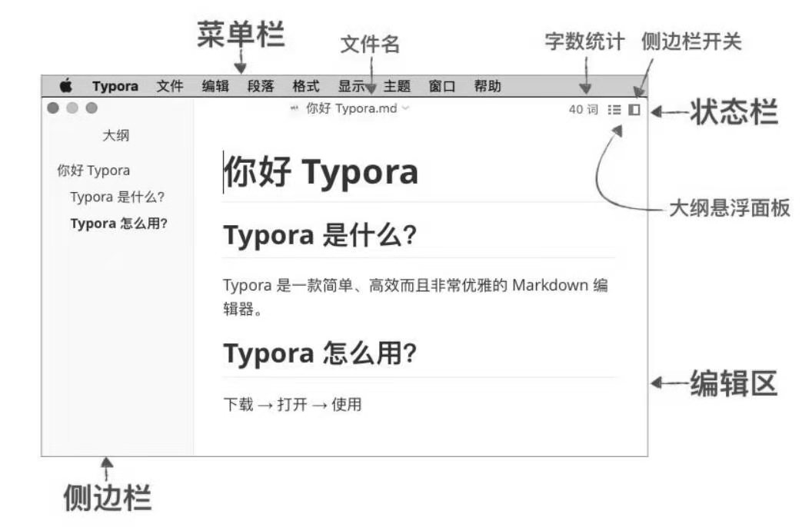

# MarkDown 助力高效写作

Markdown 是一种轻量级标记语言，它用简洁的语法代替排版，让你沉浸在写作的乐趣之中。它的目标是实现易读易写，成为一种适用于网络的书写语言。

在日常工作和互联网写作中，MarkDown 几乎随处可见，并且扮演着越来越重要的角色。不管你是不是程序员，只要关乎写作，都离不开 MarkDown， 它的流行已经形成一种趋势。包括知乎、简书、掘金、CSDN、GitHub、WordPress、印象笔记、有道云笔记等都支持 MarkDown，MarkDown 俨然已成为最流行的“写作语言”。

## 为什么使用 MarkDown

当你对文章的排版没有什么特殊需求，且不想花费太多时间在排版上，那么 MarkDown 就是写作文档的最佳方案。作为技术人员我们要更应该具备输出能力，利用 MarkDown 的特点无需关心样式, 就可以实现写文档、写文章、写博客、分享知识等，你只需专注于写作内容就行了。使用支持  MarkDown 的编辑器或者平台会自动对文章进行排版，最终的效果也会非常简洁漂亮。

MarkDown 使用很简单，可以在短时间内学会，它可以使用很多编辑器快速打开，兼容性好，能做到一处编写，随处可用。它可以应用于几乎所有的写作场景，它是专注写作的最佳方案。

## 简明语法

### 标题

- 最多支持6级标题，在行首插入 `#` 作为标题
- `#` 号的个数表示标题的等级
- 建议在最后一个 `#` 和标题内容之间加一个空格
- 建议在标题前后都空一行

```md
<!-- 例如 -->
# 一级标题

## 二级标题

### 三级标题

#### 四级标题

##### 五级标题

###### 六级标题

```

### 粗体和斜体

- 粗体由两个`*`或两个`_`包裹
- 斜体由一个`*`或一个`_`包裹
- 建议都使用`*`包裹

```md
<!-- 例如 -->
**粗体**
*斜体*
__粗体__
_斜体_
```

### 列表

- 无序列表使用 `-` 符号开头
- 有序列表使用 `数字.` 开头，子列表加 tab；
- 待办事项增加 `[ ]` 或 `[X]`

```md
<!-- 示例 -->
- 无序列表1
  - 无序子列表1
  - 无序子列表2
- 无序列表2

1. 列表1
2. 列表2
   1. 子列表1
   2. 子列表2
3. 列表

- [ ] 待办事项
- [x] 已完成
```

**展示效果：**

- 无序列表1
  - 无序子列表1
  - 无序子列表2
- 无序列表2

1. 列表1
2. 列表2
   1. 子列表1
   2. 子列表2
3. 列表

- [ ] 待办事项
- [X] 已完成

### 链接

- 使用 `[描述](链接地址)` 为文字增加外链接
- 使用 `<链接地址>` 外部链接地址
- 使用 \!\[描述](图片链接地址) 插入图片。

例如：

[GitHub 官网](https://github.com/)

<https://github.com/>


### 表格

```md
| 项目        | 价格   |  数量  |
| --------   | -----:  | :----:  |
| 计算机     | ￥1600 |   5     |
| 手机        |   ￥12   |   12   |
| 管线        |    ￥1    |  234  |
```

**输出效果：**

| 项目        | 价格   |  数量  |
| --------   | -----:  | :------:  |
| 计算机     | ￥1600 |   5     |
| 手机        |   ￥12   |   12   |
| 管线        |    ￥1    |  234  |

## 选择 MarkDown 编辑器

MarkDown 的工作流程很简单，只需挑一款好用的编辑器即可。正所谓“好马配好鞍”，好的编辑工具可以让写作事半功倍。

### Typora

是一款功能全面、简洁高效，而且又非常优雅的 MarkDown 编辑器。官网地址：<https://www.typora.io/>


### VS Code

前端推荐使用 VS Code ，借助 VS Code (是一款轻量级代码编辑器) 自身的编辑功能和丰富的扩展插件，我们能够轻易打造一个功能强大而又极具个性的 MarkDown 编辑器。如果习惯使用 idea 快捷键，可以安装 IDEA Key Bindings for Visual Studio Code 插件。
