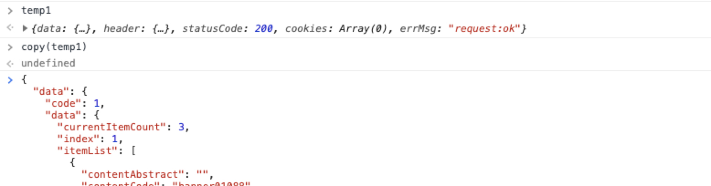
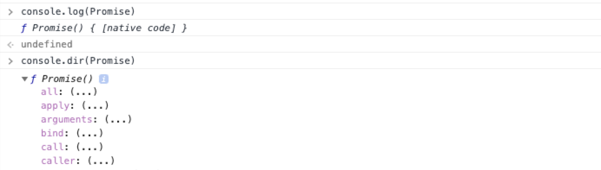
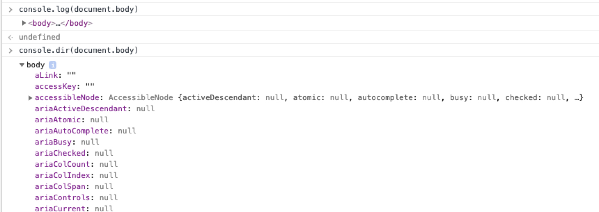
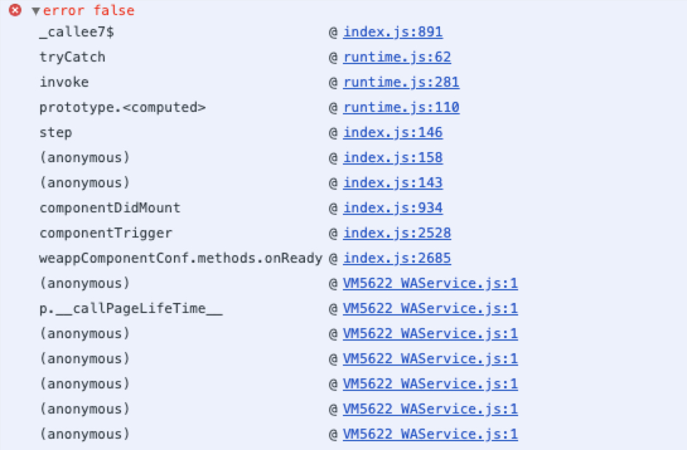
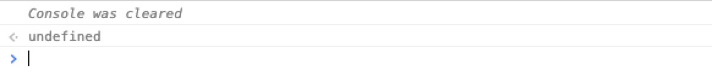
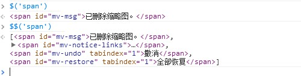
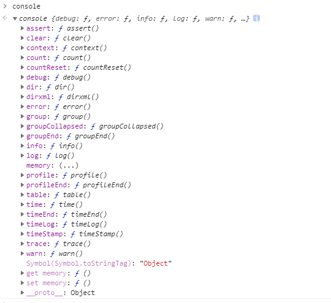
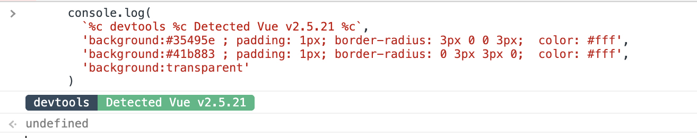

# Chrome 控制台实用技巧

许多程序员仅知道 Chrome 的 `console.log`，其实控制台 API 还包含一些其他实用的方法，这些方法在对时间有要求的情况下非常有用，能够大大提高工作效率。

打开Chrome控制台的方式 （F12）：

1. 菜单-> 更多工具-> 开发者工具；
2. 按 `F12`或者 `Ctrl + Shift + i`（PC 端）/`Alt + Command + i`(Mac 平台)；
3. 在一个页面元素上，打开右键菜单，选择 -> "审查元素"。

## copy 函数

copy 函数可以将在控制台获取到的内容(DOM对象，基本类型、引用类型等等，JSON，任何变量)复制到剪贴板。

copy 函数示例：


然后就可以到处粘贴了，你可以将其粘贴到任意文本编辑器。上例只采用了很简单的对象，如果从后端 API 返回一个非常复杂的对象就非常有用了，而且 `copy` 后的对象还自带格式化。

如图保存为全局变量：


生成全局变量后，再执行 copy(temp1)



## console.dir

如果要查看对象的所有属性和方法，console.dir 方法要比 console.log 更加实用，使用 dir 和 log 在控制台上输出的效果如下：



神奇的是，你可以输出 DOM 元素的所有属性和方法：



## console.time 和 console.timeEnd

你可以跟踪一个函数的调用所消耗的时长，这对优化代码很有帮助，如下代码：


time 方法表示计时开始，timeEnd 方法表示计时结束。它们的参数是计时器的名称。调用 timeEnd 方法之后，console 窗口会显示“计时器名称: 所耗费的时间”。

## console.error 和 console.warn

console.error 和 console.warn 的用法和console.log一样，它们的好处在于会提供栈追踪，合理使用 error 和 warn 有助于更快速的定位问题，效果如图：



## console.clear

console.clear 可以清空控制台，效果如图所示：



## \$(selector) 和 $$(selector)

Chrome原生支持 类 jQuery 选择器。

- `$(selector)` 返回满足条件的第一个DOM元素
- `$$(selector)` 返回满足条件的所有DOM元素



- 实际上 `$(selector)` 是对 原生 JavaScript 的 `document.querySelector()` 的封装
- 实际上 `$$(selector)` 是对 原生 JavaScript 的 `document.querySelectorAll()` 的封装

## 其它 API

console.table(), console.count(), console.info(), console.assert 等，各自有不同的效果，可以自行尝试。


console 的打印方法都支持格式化输出：

console.log支持的格式标志有:
| 占位符  |  描述 |
|:---:|:---:|
| %s  |  字符串 |
| %d%i  |  整数 |
| %f  |  浮点数 |
| %o/%O  |  object对象 |
| %c  |  css样式 |

还支持自定义输出样式，增加样式示例如下：

```js
  console.log(
    `%c vue-devtools %c Detected Vue v2.5.21 %c`,
    'background:#35495e ; padding: 1px; border-radius: 3px 0 0 3px;  color: #fff',
    'background:#41b883 ; padding: 1px; border-radius: 0 3px 3px 0;  color: #fff',
    'background:transparent'
  )
```


